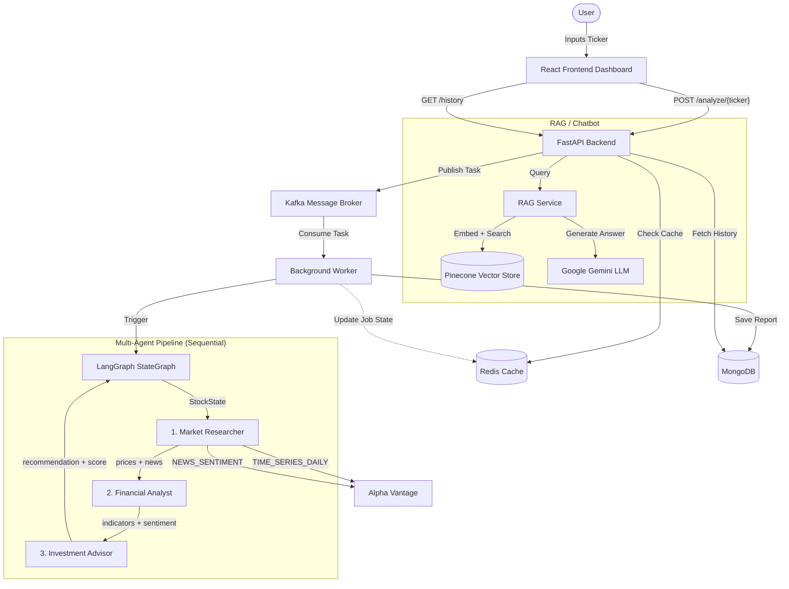

# System Architecture: Multi-Agent Stock Analysis Platform

## Component Description

- **React Frontend**: Giao diện React 18 + Vite, hiển thị real-time loading state trong khi agent xử lý, render báo cáo phân tích, biểu đồ giá kèm MA5/MA20 (Recharts LineChart, 60 ngày gần nhất) và khuyến nghị đầu tư.
- **FastAPI Backend**: Cung cấp REST API cho phân tích cổ phiếu, xác thực JWT (OAuth2), quản lý user, chatbot RAG và admin dashboard.
- **Kafka Message Broker**: Hàng đợi tác vụ bất đồng bộ giữa API và Worker. Sử dụng `aiokafka`.
- **Background Worker**: Consume job từ Kafka, cập nhật trạng thái vào Redis và kích hoạt LangGraph pipeline.
- **Redis Cache**: Cache tốc độ cao với TTL theo loại dữ liệu:
  - `price` → 10s
  - `history` → 10 phút
  - `news` → 1 giờ
  - `ai_result` → 3 phút
  - `job` → 1 giờ
- **LangGraph StateGraph**: Điều phối pipeline 3 agent theo thứ tự tuần tự qua `StockState` TypedDict. Có conditional edge dừng pipeline khi gặp lỗi ở bất kỳ node nào.
- **Market Researcher Agent**: Thu thập dữ liệu giá lịch sử (`TIME_SERIES_DAILY`) và tin tức thị trường (`NEWS_SENTIMENT`) đồng thời qua `asyncio.gather`. Nguồn duy nhất: **Alpha Vantage**.
- **Financial Analyst Agent**: Tính toán toàn bộ chỉ số kỹ thuật thuần thuật toán (không dùng LLM):
  - **SMA**: MA5 / MA20 / MA50 / MA100
  - **EMA**: EMA12 / EMA26
  - **Momentum**: RSI-14 (Wilder's Smoothed), MACD (12/26/9)
  - **Volatility**: Bollinger Bands (20 kỳ, 2σ), ATR-14
  - **Trend strength**: ADX-14 (kèm +DI / −DI)
  - **Price action**: phát hiện xu hướng 5 nến, biến động khối lượng
  - **Sentiment**: tổng hợp điểm tin tức theo relevance score
- **Investment Advisor Agent**: Khuyến nghị Buy/Hold/Sell **hoàn toàn bằng rule-based scoring, không dùng LLM**:
  - Thang điểm −10 → +10 qua 8 yếu tố: MA Crossover (±2), RSI (±2), MACD crossover (±2), Bollinger Bands (±1), Volume confirmation (±1), Trend multi-candle (±1), Sentiment (±1), ADX (±2)
  - BUY nếu score ≥ +4, SELL nếu score ≤ −4, HOLD còn lại
  - Target price và stop-loss động tính từ ATR (target = price ± 2×ATR, stop = price ∓ 1×ATR)
  - Độ tin cậy (confidence) giảm khi ADX < 20 (thị trường sideway)
- **RAG Service**: Pipeline Retrieval-Augmented Generation dùng HuggingFace embeddings + Pinecone vector store + Gemini để trả lời câu hỏi dựa trên tài liệu PDF.
- **MongoDB**: Lưu trữ lịch sử báo cáo phân tích, thông tin user và quotes.
