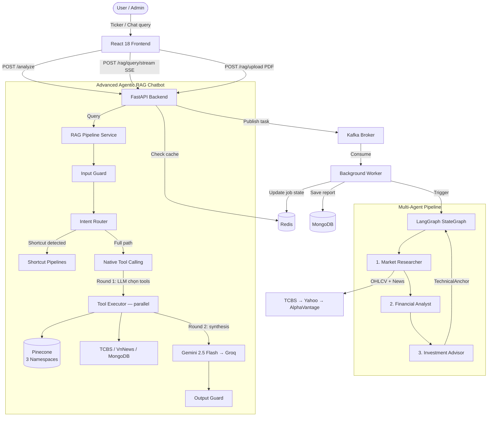

# System Architecture: Multi-Agent Stock Advisor

## Tổng quan hệ thống



---

## Multi-Agent Pipeline

### Market Researcher
- Thu thập OHLCV và tin tức **đồng thời** qua `asyncio.gather`.
- Nguồn dữ liệu theo thứ tự ưu tiên: **TCBS API → Yahoo Finance (`yfinance`) → Alpha Vantage**.
- Tin tức: VnNews / CafeF (tiếng Việt) + Alpha Vantage NEWS_SENTIMENT.

### Financial Analyst
Tính toán thuần thuật toán, không dùng LLM:

| Nhóm | Chỉ báo |
|---|---|
| Trend | SMA MA5/MA20/MA50/MA100, EMA12/EMA26 |
| Momentum | RSI-14 (Wilder's Smoothed), MACD (12/26/9) |
| Volatility | Bollinger Bands (20 kỳ, 2σ), ATR-14 |
| Trend Strength | ADX-14 (+DI / −DI) |
| Price Action | Xu hướng 5 nến, biến động khối lượng |
| Sentiment | Tổng hợp điểm tin tức theo relevance score |

### Investment Advisor + TechnicalAnchor
Rule-based scoring **hoàn toàn không dùng LLM** — kết quả là **TechnicalAnchor** (nguồn sự thật duy nhất):

| Yếu tố | Điểm |
|---|---|
| MA Crossover (MA5 vs MA20) | ±2 |
| RSI (overbought/oversold) | ±2 |
| MACD Crossover | ±2 |
| ADX (trend strength) | ±2 |
| Bollinger Bands (squeeze/breakout) | ±1 |
| Volume Confirmation | ±1 |
| Multi-candle Trend | ±1 |
| News Sentiment | ±1 |

- **BUY** nếu score ≥ +4 | **SELL** nếu score ≤ −4 | **HOLD** còn lại
- Target = price ± 2×ATR | Stop-loss = price ∓ 1×ATR
- Confidence giảm khi ADX < 20 (thị trường sideway)

---

## Advanced Agentic RAG Chatbot

### Luồng xử lý mỗi query

```
User query
    │
    ▼
[1] Input Guard ──────── Validate độ dài, detect Prompt Injection (15+ patterns EN+VI),
    │                    mask dữ liệu nhạy cảm (số tài khoản, email, thẻ)
    │
    ▼
[2] Shortcut Router ──── Regex detect → trả về ngay, KHÔNG tốn LLM call:
    │                    • Giá cổ phiếu  → TCBS/Yahoo (0 LLM)
    │                    • So sánh giá   → TCBS/Yahoo (0 LLM)
    │                    • Top BUY       → MongoDB query (0 LLM)
    │                    • Cache hit     → Redis response cache (0 LLM)
    │
    ▼
[3] Specialized Shortcuts ── Regex detect → 1 LLM call:
    │                    • Technical Analysis → TCBS + TechnicalAnchor + Gemini
    │                    • Market Overview   → TCBS Public API + Gemini
    │                    • News              → VnNews/CafeF + Gemini
    │
    ▼
[4] Native Tool Calling ─ Mọi query phức tạp còn lại:
    │
    ├─ Pre-route (rule-based, 0 LLM):
    │   Intent rõ ràng (confidence ≥ 0.68) → pre-select tools, skip Round 1
    │
    ├─ Round 1 (1 LLM call, chỉ khi pre-route không tự tin):
    │   Gemini bind_tools → quyết định tool nào cần gọi
    │
    ├─ Parallel Tool Execution:
    │   get_technical_analysis  → TCBS + InvestmentRuleEngine (0 LLM)
    │   get_rag_advisory        → Pinecone internal-advisory + Gemini (1 LLM)
    │   get_rag_knowledge       → Pinecone public-knowledge + Gemini (1 LLM)
    │   get_faq                 → Pinecone faq-complaint + Gemini (1 LLM)
    │   get_price_info          → TCBS/Yahoo (0 LLM)
    │   get_stock_news          → VnNews (0 LLM)
    │   get_market_overview     → TCBS Public API (0 LLM)
    │   get_top_buy_list        → MongoDB (0 LLM)
    │
    └─ Round 2 Synthesis (1 LLM call):
        Gemini tổng hợp kết quả các tools
        TechnicalAnchor là nguồn bắt buộc cho BUY/SELL/HOLD
        │
        ▼
[5] CRAG Evaluator ──── Heuristic score-based (similarity scores từ Pinecone)
    │                   → LLM Judge chỉ khi AMBIGUOUS (tiết kiệm ~75% CRAG quota)
    │                   CORRECT → generate | AMBIGUOUS → penalty | INCORRECT → từ chối
    │
    ▼
[6] Output Guard ─────── Confidence gate (< 0.38 → escalate)
                         Mandatory disclaimer cho advisory response
                         Hallucination signal detection (regex patterns)
                         Audit log → MongoDB rag_audit_logs
```

### Chi phí LLM theo loại query

| Query type | LLM calls | Ghi chú |
|---|---|---|
| Giá cổ phiếu / So sánh giá / Top BUY | **0** | Shortcut, data API |
| Cache hit | **0** | Redis response cache |
| Technical Analysis / Market / News | **1** | Specialized shortcut |
| Knowledge / FAQ đơn giản | **1** | Direct pipeline |
| Advisory phức tạp (pre-route) | **2** | Skip Round 1 |
| Advisory phức tạp (LLM route) | **3** | Round 1 + tool + synthesis |
| Advisory + CRAG AMBIGUOUS | **+1** | CRAG LLM judge thêm |

### Hybrid Search & Reranking

```
Query
  │
  ├─ Dense Retrieval ── paraphrase-multilingual-MiniLM-L12-v2 (384-dim, CPU)
  │                     similarity_search_with_score trên từng namespace
  │
  ├─ Similarity Threshold Filter
  │   internal-advisory : 0.45
  │   public-knowledge  : 0.40
  │   faq-complaint     : 0.72
  │
  ├─ BM25 Sparse Scoring ── rank_bm25 trên filtered docs
  │
  ├─ RRF Fusion ─────────── Dense score × 0.6 + Sparse score × 0.4 (weighted)
  │
  └─ Cross-Encoder Rerank ── ms-marco-MiniLM-L-6-v2 (advisory only)
```

### Hierarchical Chunking (Small-to-Big)

```
PDF
  │
  ├─ Parent Splitter → Parent chunks (3000 chars, overlap 300)
  │     └─ Child Splitter → Child chunks (1500 chars, overlap 200)
  │
  │   Child chunk: embed + upsert vào Pinecone
  │   Metadata["parent_text"]: lưu parent context (2000 chars)
  │
  └─ Khi retrieve: trả child chunk (precise match)
                   LLM nhận parent_text (đủ context)
```

### Pinecone Namespaces

| Namespace | Dữ liệu | Similarity threshold |
|---|---|---|
| `internal-advisory` | Báo cáo tài chính, phân tích, tư vấn | 0.45 |
| `public-knowledge` | Kiến thức CK, pháp luật, thuật ngữ | 0.40 |
| `faq-complaint` | FAQ hỗ trợ khách hàng | 0.72 |

---

## Caching Strategy (Redis)

| Key | TTL | Mục đích |
|---|---|---|
| `price:{ticker}` | 10s | Giá realtime |
| `history:{ticker}` | 10 phút | Lịch sử OHLCV |
| `news:{ticker}` | 15 phút | Tin tức cổ phiếu |
| `ai_result:{ticker}` | 3 phút | Kết quả phân tích AI |
| `rag_response:{md5}` | 2 giờ | Cache câu trả lời RAG (MD5 hash của query) |
| `conv:{session_id}` | 2 giờ | Conversation memory server-side (max 10 turns) |
| `ticker_ctx:{session_id}` | 30 phút | Session ticker context |
| `rate:{user}:stream` | 60s | Rate limit (30 req/min) |
| `rate:{user}:query` | 60s | Rate limit (60 req/min) |
| `job:{id}` | 1 giờ | Trạng thái Kafka job |

---

## Component Overview

| Component | Vai trò |
|---|---|
| **React 18 + Vite** | SPA Frontend, custom CSS, Framer Motion, Recharts |
| **FastAPI + Uvicorn** | REST API, SSE streaming, JWT OAuth2 |
| **LangGraph StateGraph** | Điều phối 3 agent tuần tự, conditional error edges |
| **RAGPipelineService** | Core RAG engine — guardrails, routing, tool calling |
| **VectorStoreService** | Pinecone wrapper — hybrid search, rerank |
| **PDFProcessorService** | PDF extraction (PyMuPDF + fallback) + hierarchical chunking |
| **InvestmentRuleEngine** | Rule-based scoring → TechnicalAnchor (0 LLM) |
| **LLMProvider** | Gemini 2.5 Flash → Groq Llama-3.3-70b → Pre-computed Anchor (last resort) |
| **ConversationMemory** | Server-side conversation history per session, Redis list (`conv:{session_id}`), TTL 2h, max 10 turns |
| **Kafka + aiokafka** | Async task queue (phân tích nền) |
| **MongoDB (motor)** | Reports, users, knowledge_base metadata, audit logs |
| **Redis** | Cache đa tầng, rate limiting, session context |
