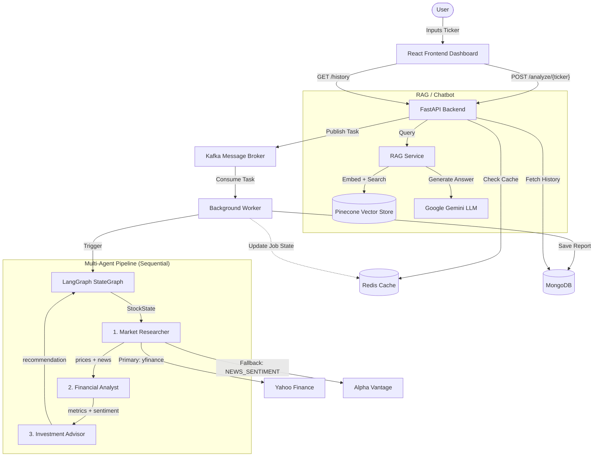

# System Architecture: Multi-Agent Stock Analysis Platform

## Component Description

- **React Frontend**: Giao diện React 18 + Vite, hiển thị real-time loading state trong khi agent xử lý, render báo cáo phân tích, biểu đồ giá (Recharts) và khuyến nghị đầu tư.
- **FastAPI Backend**: Cung cấp REST API cho phân tích cổ phiếu, xác thực JWT (OAuth2), quản lý user, chatbot RAG và admin dashboard.
- **Kafka Message Broker**: Hàng đợi tác vụ bất đồng bộ giữa API và Worker. Sử dụng `aiokafka`.
- **Background Worker**: Consume job từ Kafka, cập nhật trạng thái vào Redis và kích hoạt LangGraph pipeline.
- **Redis Cache**: Cache tốc độ cao với TTL theo loại dữ liệu:
  - `price` → 10s
  - `history` → 10 phút
  - `news` → 1 giờ
  - `ai_result` → 3 phút
  - `job` → 1 giờ
- **LangGraph StateGraph**: Điều phối pipeline 3 agent theo thứ tự tuần tự qua `StockState` TypedDict. Có conditional edge dừng pipeline khi gặp lỗi.
- **Market Researcher Agent**: Thu thập dữ liệu giá lịch sử (yfinance) và tin tức (yfinance → Alpha Vantage fallback).
- **Financial Analyst Agent**: Tính toán MA5/MA20/MA50/MA100, xu hướng giá, biến động khối lượng và điểm sentiment từ tin tức (TextBlob).
- **Investment Advisor Agent**: Kết hợp dữ liệu phân tích với Gemini LLM để tạo khuyến nghị Buy/Hold/Sell kèm đánh giá chi tiết.
- **RAG Service**: Pipeline Retrieval-Augmented Generation dùng HuggingFace embeddings + Pinecone vector store + Gemini để trả lời câu hỏi dựa trên tài liệu PDF.
- **MongoDB**: Lưu trữ lịch sử báo cáo phân tích, thông tin user và quotes.
